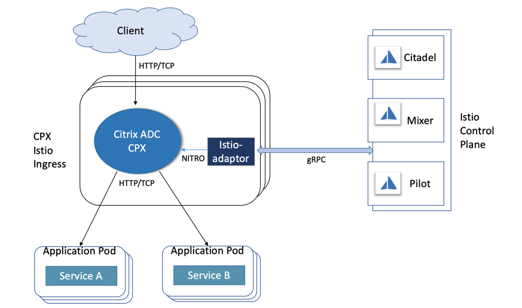
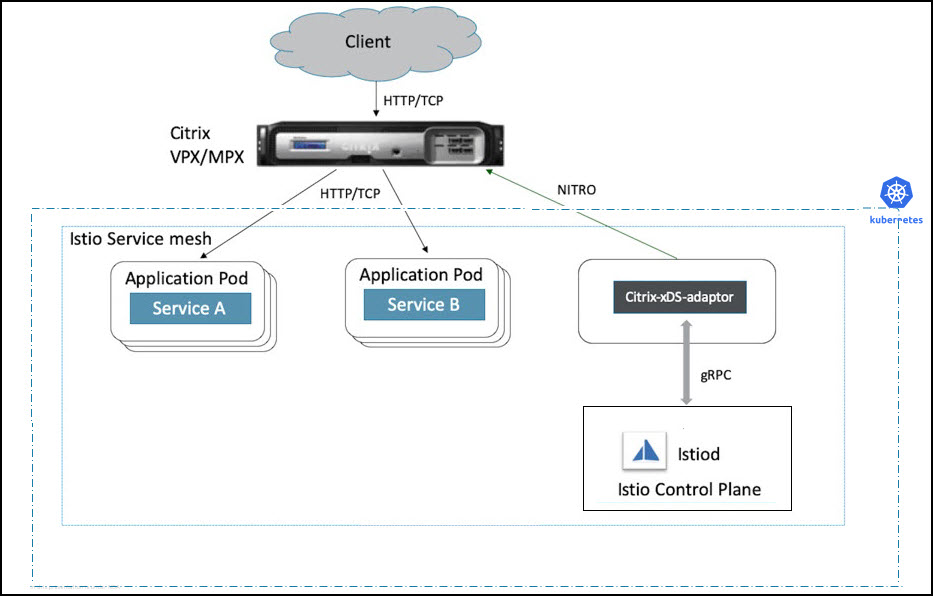
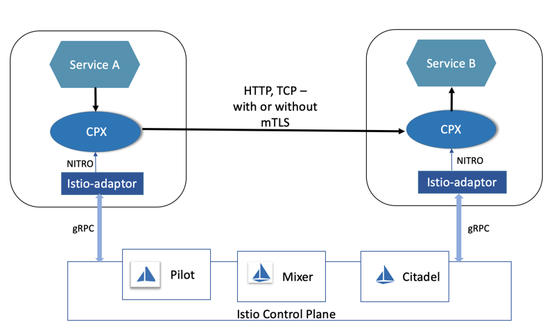
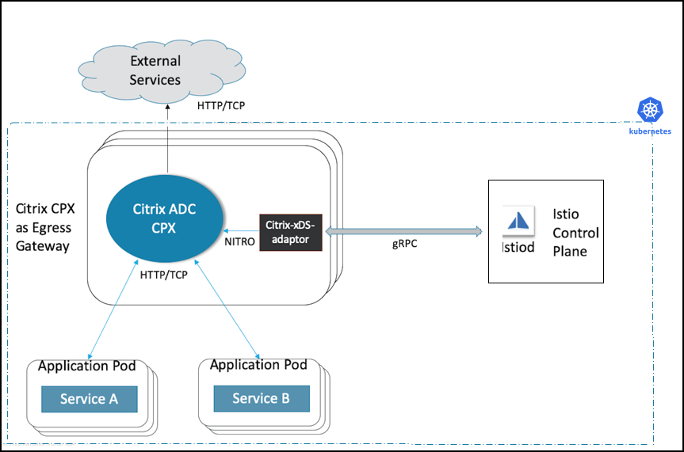

# Deployment architecture

The Istio service mesh can be logically divided into control plane and data plane components. The data plane is composed of a set of proxies which manage the network traffic between instances of the service mesh. The control plane generates and deploys the configuration that controls the data plane's behavior.
For detailed information on Istio architecture and different components, see [Istio docs](https://istio.io/docs/concepts/what-is-istio/#architecture).

## Integration with Istio control plane components

The Istio control plane is a set of gRPC based services and it pushes configuration changes to clients listening at the data plane. Pilot, Mixer, Galley, and Citadel are important control plane components. Out of these components, the data plane proxy primarily needs to interact with Pilot and Citadel.
 
**Pilot** is a gRPC based xDS server and provides configuration data to proxies. Citrix provides an xDS client called `xDS-adaptor` to communicate with the Istio control plane for installing Citrix ADCs in Istio service mesh. It acts as a gRPC client to the control plane API server and listens to updates. Based on the updates from the control plane, `xDS-adaptor` generates the equivalent Citrix ADC configuration. Then, it configures the Citrix ADC ingress or proxy device accordingly.

**Citadel** is a control plane service which provides key and certificate management. It is responsible for providing TLS certificates to data plane proxies. Citrix `xDS-adaptor` monitors secrets managed by Citadel, and updates the Citrix ADC proxy with relevant details.

Citrix service mesh solution provides a container, [Citrix ADC Metrics Exporter](https://github.com/citrix/citrix-adc-metrics-exporter), which collects the statistical data from Citrix ADC Ingress Gateway device and exports it to [Prometheus](https://prometheus.io).

Citrix also provides its own in-house solution [Citrix ADC Observability Exporter](https://github.com/citrix/citrix-observability-exporter) for the telemetry purpose. Citrix ADC CPX running as a sidecar proxy interacts with the Citrix ADC Observability Exporter. Citrix ADC CPX sends metrics and transactions to Citrix ADC Observability Exporter. Citrix ADC Observability Exporter supports endpoints such as Zipkin and Prometheus, and sends the data collected from sidecar proxies to these endpoints in an appropriate format.

Citrix ADC can be integrated with Istio in three ways:

-  Citrix ADC CPX, MPX, or VPX as an Ingress Gateway to the service mesh
-  Citrix ADC CPX as a sidecar proxy with application containers in the service mesh

- Citrix ADC CPX as an Egress Gateway for the service mesh

All the modes can be combined to have a unified data plane solution.

## Deploy Citrix ADC as an Ingress Gateway

An Istio Ingress Gateway acts as an entry point for the incoming traffic to the service mesh. It secures and controls access to the service mesh from outside. You can deploy a Citrix ADC CPX, MPX, or VPX as an ingress Gateway to the Istio service mesh.

### Citrix ADC CPX as an Ingress Gateway

The Citrix ADC CPX Ingress Gateway is deployed as a set of horizontal scaling Kubernetes pods. Each pod runs a Citrix ADC CPX that controls and routes the incoming requests.
Each pod also runs an `xDS-adaptor` container as a sidecar to the Citrix ADC. The `xDS-adaptor` container establishes a connection with Istio control plane components, reads the ingress policies applied, and configures the Citrix ADC CPX accordingly.

The following diagram shows a sample deployment of Citrix ADC CPX as an Ingress Gateway.

For detailed instructions on how to deploy Citrix ADC CPX as an Ingress Gateway, see [Deploying Citrix ADC with Istio](deploy-istio-adaptor-helm-chart.md).

### Citrix ADC MPX or VPX as an Ingress Gateway

Citrix ADC VPX or MPX can be deployed as an Ingress Gateway to the Istio service mesh. In this deployment, a Kubernetes pod is deployed with an `xDS-adaptor` container. The `xDS-adaptor` container connects to the Istio control pane and reads the ingress configuration and then configures the Citrix ADC VPX or MPX accordingly.

**Note:** For this deployment, establish the connectivity between the concerned Citrix ADC and the cluster nodes.

The following diagram shows a sample deployment of Citrix ADC VPX/MPX as an Ingress Gateway.

For detailed instructions on how to deploy Citrix ADC VPX or MPX as an Ingress Gateway, see [Deploying Citrix ADC with Istio](deploy-istio-adaptor-helm-chart.md).

## Deploy Citrix ADC CPXs as sidecars

Citrix ADC CPX can be deployed as a sidecar proxy in application pods. It intercepts all the incoming and outgoing traffic from the application pod and applies the configured routing policies or rules.

In this deployment, each application pod contains a Citrix ADC CPX and an `xDS-adaptor` container along with the application container.
The `xDS-adaptor` container listens to updates from the Istio control plane and configures the Citrix ADC CPX instance accordingly.

The following diagram shows a sample deployment of Citrix ADC CPXs as sidecars.

For detailed instructions on how to deploy Citrix ADC CPX as a sidecar, see [Deploying Citrix ADC with Istio](deploy-istio-adaptor-helm-chart.md).

## Deploy Citrix ADC CPX as an Egress Gateway

An Egress Gateway defines the traffic exit point from a service mesh. Citrix ADC CPX as an Egress Gateway performs load balancing, monitoring at the edge of the service mesh, and provides routing rules to exit the service mesh.

The following diagram shows a sample deployment of Citrix ADC CPX as an Egress Gateway.

For detailed instructions on how to deploy Citrix ADC CPX as an Egress Gateway, see [Deploying Citrix ADC with Istio](deploy-istio-adaptor-helm-chart.md).